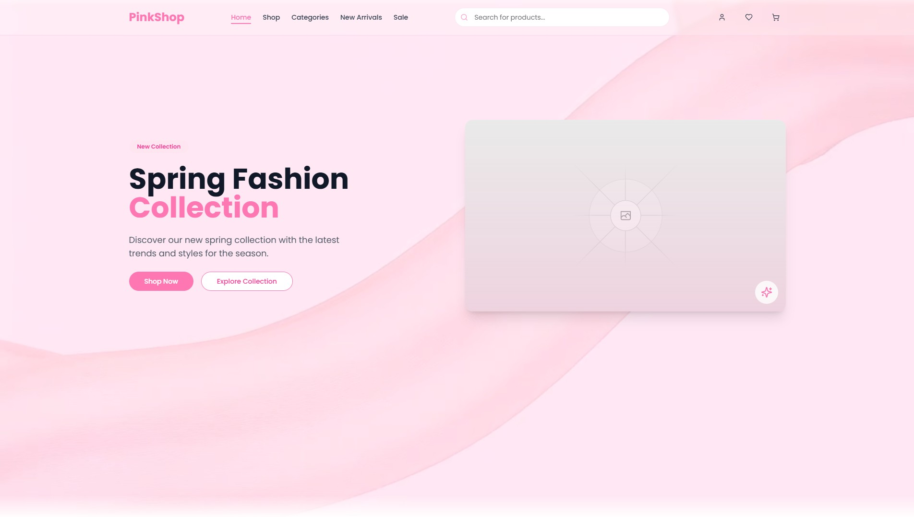

# PinkShop



## Overview

PinkShop is a modern, pink-themed e-commerce platform designed specifically for women's fashion and accessories. Built with Next.js, TypeScript, and Tailwind CSS, it offers a sleek shopping experience with smooth animations powered by Framer Motion. The feminine color palette and user interface elements are carefully crafted to appeal to female shoppers.

**Note: This is a frontend-only implementation** focusing on the UI/UX aspects of the e-commerce experience. It demonstrates modern frontend development practices and responsive design without backend integration.

## Features

- **Responsive Design**: Fully responsive design that works seamlessly across desktop, tablet, and mobile devices
- **Modern UI**: Beautiful, pink-themed user interface with elegant animations and transitions
- **Curated Collections**: Browse women's fashion by categories, new arrivals, or sales
- **Smart Search**: Search for products with women-specific filter options like size, style, and occasion
- **Product Experience**:
  - Quick View functionality with zoom features
  - Detailed product pages with multiple-angle image galleries
  - Size and color selection with fit recommendations
- **Cart & Wishlist**: Fully functional cart and wishlist features to save favorite items
- **Personalized Profiles**: User account management, saved addresses, and secure payment methods
- **Smooth Interactions**: Elegant animations and transitions using Framer Motion
- **Fast Performance**: Built with performance in mind for quick loading times even with image-heavy content

## Tech Stack

- **Framework**: [Next.js](https://nextjs.org/) (App Router)
- **Language**: [TypeScript](https://www.typescriptlang.org/)
- **Styling**: [Tailwind CSS](https://tailwindcss.com/)
- **UI Components**: Custom UI components with Radix UI primitives
- **Animations**: [Framer Motion](https://www.framer.com/motion/)
- **Icons**: [Lucide Icons](https://lucide.dev/)
- **State Management**: React Context API

## Project Structure

The project follows a clean, modular structure:

```
├── app/                # Next.js app router pages and layouts
├── components/         # Reusable React components
│   ├── cart/           # Cart related components
│   ├── categories/     # Category browsing components
│   ├── layout/         # Layout components (header, footer)
│   ├── navigation/     # Navigation components
│   ├── new-arrivals/   # New arrivals section components
│   ├── products/       # Product display components
│   ├── profile/        # User profile components
│   ├── providers/      # React context providers
│   ├── sale/           # Sale section components
│   ├── sections/       # Page sections (hero, benefits, etc.)
│   ├── shop/           # Shop page components
│   └── ui/             # UI components (buttons, inputs, etc.)
├── data/               # Sample data for products and categories
├── hooks/              # Custom React hooks
├── lib/                # Utility functions and libraries
├── public/             # Static assets
├── styles/             # Global styles
└── types/              # TypeScript type definitions
```

## Key Components

- **Layout Components**: Reusable header, footer, and navigation components
- **Product Components**: Cards, grids, and detailed product views
- **UI Components**: Buttons, inputs, modals, and other UI elements
- **Section Components**: Hero sections, category displays, product showcases

## UI Features

The app includes several sophisticated UI elements:

- Elegantly animated product cards with soft hover effects
- Toast notifications for user actions
- Stylish modal dialogues for quick product views
- Smooth page transitions with subtle pink accents
- Graceful loading states with custom animations
- Mobile-friendly navigation and intuitive filters

## Getting Started

### Prerequisites

- Node.js (v18 or higher)
- pnpm (recommended) or npm

### Installation

1. Clone the repository:

```bash
git clone https://github.com/Tanjim-Islam/ecommerce-pinkshop.git
cd ecommerce-pinkshop
```

2. Install dependencies:

```bash
pnpm install
# or
npm install
```

3. Run the development server:

```bash
pnpm dev
# or
npm run dev
```

4. Open [http://localhost:3000](http://localhost:3000) in your browser to see the application.

## Build for Production

```bash
pnpm build
# or
npm run build
```

## Customization

- **Pink Theme**: Modify `tailwind.config.ts` to adjust the color scheme and other design tokens
- **Women's Products**: Update the product data in `data/index.ts` to add your own women's fashion items
- **Styling**: Global styles can be found in `app/globals.css` and component-specific styles in their respective files

## Performance Optimization

The application includes several performance optimizations:

- Image optimization via Next.js Image component
- Page transitions for smoother navigation
- Lazy loading of components
- Custom loading states
- CSS and JS minification in production builds

## Browser Support

The application is optimized for modern browsers and includes polyfills for broader compatibility.

## License

This project is licensed under the MIT License - see the LICENSE file for details.

## Acknowledgements

- UI design inspired by modern e-commerce trends
- Built with the excellent Next.js framework
- Styled with the utility-first Tailwind CSS
- Animations powered by Framer Motion
